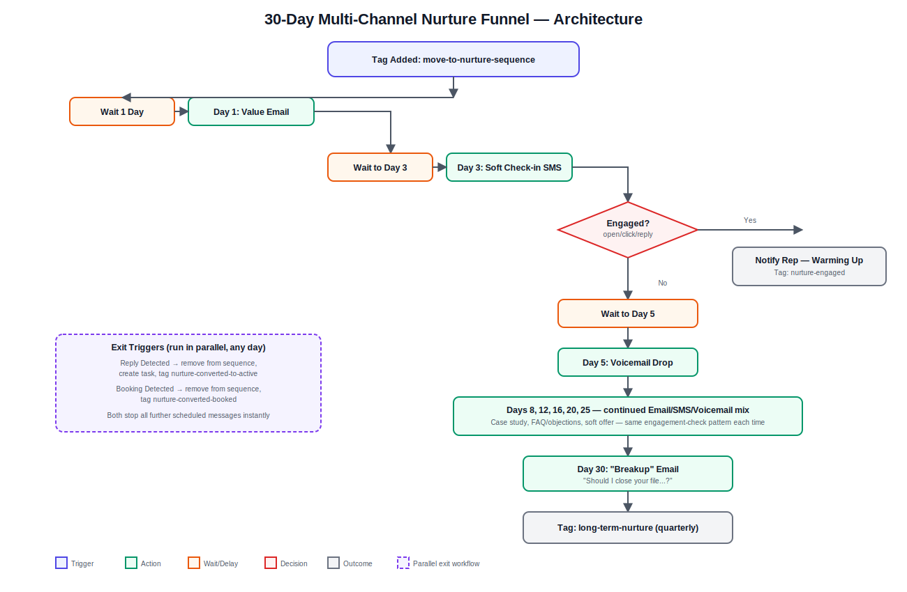

# Multi-Channel Nurture Funnel — GoHighLevel + n8n Automation

> Built by [Sohag Gain](https://bd.linkedin.com/in/sohaggain) — GoHighLevel Automation Specialist & Founder, [AI Smart Galaxy](https://aismartgalaxy.com)

## 🎯 The Problem

Most businesses treat a non-responsive lead as a dead lead. One or two follow-ups, then the contact just sits in the CRM untouched. But leads go cold for all kinds of reasons — bad timing, distraction, budget — not necessarily disinterest. Without a system to keep the door open, that pipeline value is simply written off.

## 💡 The Solution

I built a **30-day multi-channel nurture funnel** in GoHighLevel, orchestrated with n8n, that re-engages cold leads (fed in automatically from Speed-to-Lead, Missed Call, and Review Generation workflows once they go unresponsive) through a mix of Email, SMS, and voicemail drops:

- A pre-planned 30-day content calendar mixing value content, soft check-ins, case studies, and voicemail drops
- Engagement-based branching — if a lead opens, clicks, or replies, they're pulled out of the generic sequence and routed straight to a rep
- Instant exit the moment a lead replies or books an appointment — no more generic messages once they're actively engaging
- A deliberately honest "breakup" message on Day 30 that asks permission to stop, which tends to get strong response rates
- Built-in compliance: unsubscribe options on every channel

## 🏗️ Architecture



**Flow summary:**
```
Tag Added: move-to-nurture-sequence
        ↓
Day 1: Value Email
        ↓
Day 3: Soft Check-in SMS
        ↓
   Engaged? (open/click/reply)
        ├── Yes ──→ Notify Rep (warming up) + Tag: nurture-engaged
        └── No ──→ Day 5: Voicemail Drop
                        ↓
                Days 8, 12, 16, 20, 25 — continued Email/SMS/Voicemail mix
                (case study, FAQ/objections, soft offer — same engagement check each time)
                        ↓
                Day 30: "Breakup" Email
                        ↓
                Tag: long-term-nurture (quarterly check-in list)

[Parallel exit triggers — any day]
Reply Detected ──→ remove from sequence, create task, tag nurture-converted-to-active
Booking Detected ──→ remove from sequence, tag nurture-converted-booked
```

## ⚙️ Tech Stack

- **GoHighLevel** — Workflows, Voicemail Drop, Conversations, Tasks, Tags
- **n8n** — orchestration for the 30-day timing cadence and engagement-based branching
- **GHL LeadConnector API** — Conversations/Messages, Tasks, Contacts, Tags endpoints

## 🔑 Key Features

- **True multi-channel** — Email, SMS, and voicemail drop combined, not just one channel repeated
- **Engagement-aware branching** — the sequence adapts in real time instead of blindly running the same script for every lead
- **Instant exit on reply or booking** — no lead ever gets an awkward automated message after they've already engaged
- **Honest, low-pressure close** — the Day 30 breakup message respects the lead's time and often re-opens the conversation
- **Feeds a long-term nurture list** — leads that stay cold after 30 days move to a lower-frequency quarterly check-in instead of being abandoned

## 📊 Results / Impact

- Recovers a meaningful share of leads previously written off as "dead" back into the active pipeline
- Keeps cost-per-touch low by automating channels that would otherwise require manual staff time (especially voicemail drops)
- Maintains compliance with unsubscribe requirements across every channel (CAN-SPAM/TCPA)

## 📁 Repository Contents

| File | Description |
|---|---|
| `nurture-funnel-workflow.json` | n8n workflow export — main 30-day sequence + exit-trigger sub-workflow definitions (sanitized) |
| `nurture-funnel-architecture.svg` | Full architecture/flow diagram |
| `README.md` | This file |

## ⚠️ Note on Data

This is a portfolio demonstration built with dummy data. All credentials, phone numbers, account IDs, and client-identifying information have been removed or replaced with placeholders. The workflow logic and structure are production-representative.

## 🙋 About Me

I'm **Sohag Gain**, a GoHighLevel Automation Specialist and Founder of **AI Smart Galaxy** — an AI automation agency specializing in GoHighLevel, n8n, Make.com, Zapier, and AI agent development for businesses looking to scale their lead generation and client operations.

I build systems like this one for real businesses — fully customized to their exact workflow, tech stack, and goals.

- 🌐 Website: [aismartgalaxy.com](https://aismartgalaxy.com)
- 🛠️ Services: [aismartgalaxy.com/services-ai-automation](https://aismartgalaxy.com/services-ai-automation)
- 💼 LinkedIn: [bd.linkedin.com/in/sohaggain](https://bd.linkedin.com/in/sohaggain)

**Want a system like this built for your business?** Let's talk — I can have this customized and live for you in a matter of days.
